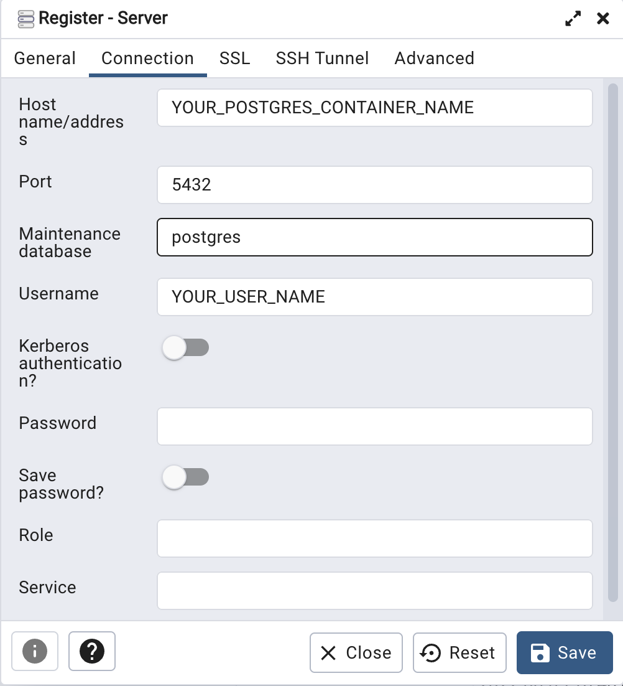

# Database-PostgreSQL

[English Version](./README.md)
## Table of Contents

* [本地（localhost）執行 PostgreSQL](#本地-(localhost)-執行-PostgreSQL)
* [執行於 docker container](#執行於-docker-container)
* [Run with docker compose](#透過-docker-compose-運行容器-(container))
* [Database Schema](#Database-Schema)

## 本地 (localhost) 執行 PostgreSQL

### 從 homebrew 下載 PostgreSQL

```shell
$ brew install postgresql
```

### 執行 PostgreSQL

```shell
$ brew services start postgresql
```

### 創建資料庫

```shell
$ createdb database_name
```

假若創建成功，則系統不會回傳任何的值，
你可以用以下方式連接到剛剛創建的資料庫

```shell
$ psql database_name
```

## 執行於 docker container

### 從 brew 下載 docker

```shell
$ brew install --cask docker
```

因為 docker 是一個系統級的 package，你不能使用 brew install 來安裝它，

而必須使用 `--cask` 代替。

接著啟動 docker ，鯨魚圖示應會出現在頂部欄中

### 取得映像檔

```shell
$ docker pull postgres:14.3
```

```shell
$ docker pull dpage/pgadmin4
```

如果沒有加上 `tag` (例如 －postgres:14.3－), 則會下載最新版的的映像檔

### 創建並運行容器 (container)

有很多選項參數可以自己選擇，在這裡我們設置：

```shell
$ docker run -e POSTGRES_USER=username \
             -e POSTGRES_PASSWORD=password \
             --net=network_name \
             -d \
             postgres:14.3
```

```shell
$ docker run -p 5050:80 \
             -e PGADMIN_DEFAULT_EMAIL=email \
             -e PGADMIN_DEFAULT_PASSWORD=password \
             --net=YOUR_network_name \
             -d \
             dpage/pgadmin4
```

我們設置 `-p` 綁定 localhost 端口到容器端口，
並設置`--net` 將兩個容器部署到同一個網路，同時我們希望兩個容器在背景運行，
所以在這裡設置 `-d`。

### 於瀏覽器運行 pgadmin

URL: `http://localhost:5050`

輸入我們剛剛設置的 pgadmin 的帳號與密碼



## 透過 docker compose 運行容器 (container)

為了一次運行多個容器，使用 docker compose 則較為方便

### 創建 `docker-compose.yaml` 檔案

>這是一個基於 docker-compose 3.7 版本的[範例程式碼][docker-compose-example]，注意不同版本之間可能存在差異。

您可以在範例程式碼中更改以下部分：

1. `POSTGRES_USER`
如有必要，請自行命名用戶名，否則 `postgres` 將是預設名稱。

2. `POSTGRES_PASSWORD`
不得為空。

3. `PGADMIN_DEFAULT_EMAIL` and `PGADMIN_DEFAULT_PASSWORD`
須自行設定帳號密碼

### 運行容器 (container)

```shell
$ docker-compose up -d
```

將 docker-compose.yaml 文件放在與你的專案相同的資料夾中，然後運行上述指令。

同時，`docker-compose` 也會創建一個網路，並將容器放入其中。

## Database Schema


[docker-compose-example]: <docker-compose-example.yaml>

### Tables and Columns

>本資料庫是為台灣的律師事務所設計的, 基於這個設計原則，我們需要以下的 tables and columns.
>_**所有的 tables 的 `PostgreSQL identity column` 以 `GENERATED ALWAYS AS IDENTITY` 的方式產生 id columns 作為主鍵 (Primary Key)，資料型態為 `INTEGER`.**_

#### `users (使用者)`

包含 _**clients (客戶)**_ 與 _**agents (代理人)**_.
透過在 `role` column 中儲存 `client` 或 `agent` 以識別該 row 的資料身份。

| Column       | Data Type                   | Description            |
| :-----       | :-----                      |:---                    |
| id           | INTEGER                     | unique ID of user      |
| role         | VARCHAR(50) NOT NULL        | 識別 clients 或 agents  |
| username     | VARCHAR(20) UNIQUE          | user 的帳號名稱          |
| password     | VARCHAR(64)                 | user 帳號的密碼          |
| first_name   | VARCHAR(50) NOT NULL        | user 的名               |
| middle_name  | VARCHAR(50)                 | user 的中間名            |
| last_name    | VARCHAR(50) NOT NULL        | user 的姓               |
| email        | VARCHAR(50) UNIQUE NOT NULL | user 的電子郵件          |
| phone        | VARCHAR(50)                 | user 的電話號碼          |
| street_name  | VARCHAR(100)                | user 的地址             |
| district     | VARCHAR(20)                 | user 地址的行政區名稱     |
| city         | VARCHAR(20)                 | user 地址的城市名稱       |
| zip_code     | VARCHAR(10)                 | user 地址的郵遞區號       |

#### `opposites (對造)`

包含對造當事人（party）及對造代理人（agent）。
如果是刑事案件或行政案件，則填入機關名稱於 organization_name。

| Column            | Data Type            | Description                                              |
| :---              | :----                | :---                                                     |
| id                | INTEGER              | An unique ID of opposite                                 |
| role              | VARCHAR(50) NOT NULL | Identify the opposite is party or agent                  |
| organization_name | VARCHAR(100)         | The name of organization                                 |
| first_name        | VARCHAR(50) NOT NULL | First name of opposite                                   |
| middle_name       | VARCHAR(50)          | Middle name of opposite                                  |
| last_name         | VARCHAR(50) NOT NULL | Last name of opposite                                    |
| email             | VARCHAR(50)          | Email of opposite                                        |
| phone             | VARCHAR(50)          | Phone number of opposite                                 |
| street_name       | VARCHAR(100)         | The part of the opposite's address below the street name |
| district          | VARCHAR(20)          | The district name of opposite's address                  |
| city              | VARCHAR(20)          | The city name of opposite's address                      |
| zip_code          | VARCHAR(10)          | The city name of opposite's address                      |

#### `courts(法院)`

將法院構建為一個 table，以便將 `section_in_charge (股別)` 和 `case(案件)` 關聯起來。.

| Column       | Data Type                    | Description        |
| :---         | :----                        | :---               |
| id           | INTEGER                      | 法院的 unique ID    |
| name         | VARCHAR(100) UNIQUE NOT NULL | 法院名稱             |
| phone        | VARCHAR(50) NOT NULL         | 法院的電話號碼       |
| street_name  | VARCHAR(100)                 | 法院地址 |
| district     | VARCHAR(20)                  | 法院地址的行政區名稱 |
| city         | VARCHAR(20)                  | 法院地址的城市名稱   |
| zip_code     | VARCHAR(10)                  | 法院地址的郵遞區號  |

#### `section_in_charges (股別)`

在臺灣的法院系統，每個案件都會被分配到特定的承辦股別，這也是法院對外的聯絡窗口，因此律師事務所在承辦案件的過程中，都必須透過該股的書記官跟法院聯繫，因此有關該股別的資訊便相當重要，需要獨立一個 table 來儲存相關資料。

| Column            | Data Type        | Description                                    |
| :---              | :----            | :---                                           |
| id                | INTEGER          | 股別的 unique ID              |
| name              | VARCHAR(20) NOT NULL     | 股別名稱                      |
| clerk_first_name  | VARCHAR(50)      | 書記官的名                    |
| clerk_middle_name | VARCHAR(50)      | 書記官的中間名                   |
| clerk_last_name   | VARCHAR(50)      | 書記官的姓                     |
| extension_number  | VARCHAR(50)      | 股別的分機號碼           |
| court_id          | INTEGER NOT NULL | 該股所在的法院 ID |

#### `events (事件)`

一個事件是很多案件的集合，一個事件可能會經過很多法院的審級，而在不同審級的法院，也分別有不同的案號。
因此有必要將事件分離到一個 table 中，作為標示不同案件是屬於哪一個事件之用。

| Column             | Data Type                    | Description                           |
| :---               | :----                        | :---                                  |
| id                 | INTEGER                      | 事件的 unique ID            |
| name               | VARCHAR(100) UNIQUE NOT NULL | 例如 “甲與乙台北市東興路房地拆屋還地事件”, “丙被訴違反證券交易法事件”, “丁與台北市政府確認文山區土地公用地役關係存在事件”                             |

#### `cases (案件)`

基本上，對於在律師事務所，可以說是以處理案件為中心在運作的。創建一個案件 table 有助於我們與其他 tables 建立關聯。

| Column                | Data Type            | Description                                     |
| :---                  | :----                | :---                                            |
| id                    | INTEGER              | 案件的 unique ID                     |
| case_closed           | boolean              | 案件是否進行中|
| category              | VARCHAR(20) NOT NULL | 案件類別，例如：民事或刑事 |
| year                  | smallint      | 案件案號的年份，以民國為紀年|
| type                  | VARCHAR(50)          | 案號字別，例如：“訴”, “上”, “重訴”, “勞訴”...等  |
| number                | VARCHAR(20)          | 案號                                 |
| cause_of_action       | VARCHAR(100)         | 案由，例如：“拆屋還地”          |
| event_id              |INTEGER NOT NULL      | 關聯事件的 ID|
| section_in_charges_id | INTEGER              | 該案件承辦股別的 ID|
| court_id             | INTEGER               | 該案件承審法院的 ID|

#### `cases_users`

Cases 及 users 之 Join table

| Column  | Data Type | Description              |
| :---    | :----     | :---                     |
| id      | INTEGER   | cases_users 的 unique ID |
| case_id | INTEGER   | cases 的 unique ID       |
| user_id | INTEGER   | users 的 unique ID       |

#### `cases_opposites`

Cases 及 opposites 之 Join table

| Column      | Data Type | Description              |
| :---        | :----     | :---                     |
| id          | INTEGER   | cases_users 的 unique ID |
| case_id     | INTEGER   | cases 的 unique ID       |
| opposite_id | INTEGER   | opposite 的 unique ID    |

#### `paper_files (書狀檔案)`

Paper's files

| Column | Data Type                    | Description                |
| :---   | :----                        | :---                       |
| id     | INTEGER                      | 書狀檔案的 unique ID        |
| name   | VARCHAR(100) UNIQUE NOT NULL | 書狀檔案的檔名               |
| file   | bytea NOT NULL               | 書狀檔案 儲存為 bytea 資料型態 |

#### `papers (書狀)`

Contains _**paper_sent (書狀遞狀時間)**_ and _**paper_received (書狀收到時間)**_.
在 `category` 輸入 `paper_sent` 或 `paper_received` 以辨認該 row 是屬於事務所寄出的還是收到的書狀。

| Column        | Data Type                   | Description                                           |
| :---          | :----                       | :---                                                  |
| id            | INTEGER                     | 書狀的 unique ID   |
| category      | VARCHAR(50)  NOT NULL       | 書狀分類，區分是事務所寄出的還是收到的書狀|
| title         | VARCHAR(100) NOT NULL       | 書狀標題，例如：民事答辯狀, 刑事辯護狀      |
| subject       | VARCHAR(400) NOT NULL       | 書狀主旨|
| sent_date     | DATE                        | 書狀遞狀日期|
| arrival_date  | DATE                        | 書狀送達對造日期|
| received_date | DATE                        | 對造收到我方遞出書狀的日期|
| deadline_date | DATE                        | 書狀應辦理之事項之最後期限|
| court_date    | TIMESTAMP                   | 書狀內記載之下次開庭日期|
| paper_type    | VARCHAR(50) NOT NULL        | 書狀類型，例如：起訴狀, 答辯狀              |
| case_id       | INTEGER NOT NULL            | 該書狀歸屬案件之案件 ID|
| paper_file_id | INTEGER NOT NULL            | 該書狀之書狀檔案 ID|
