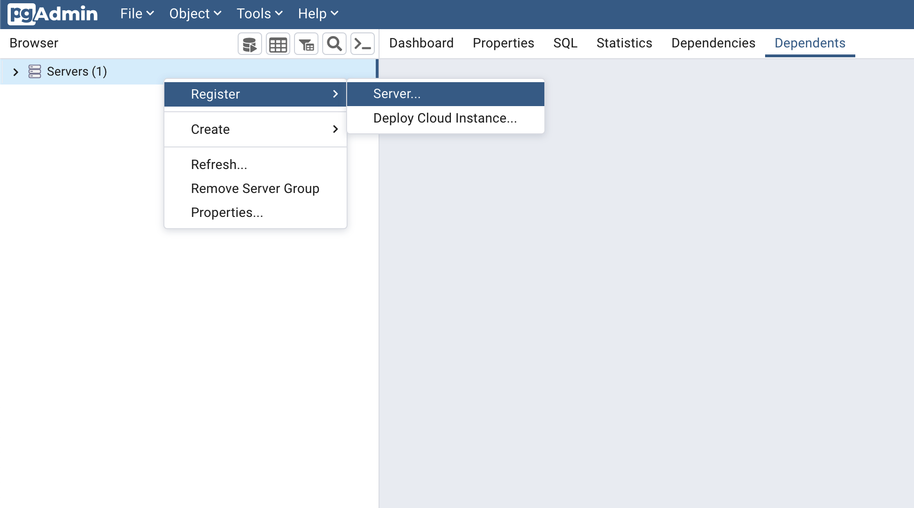
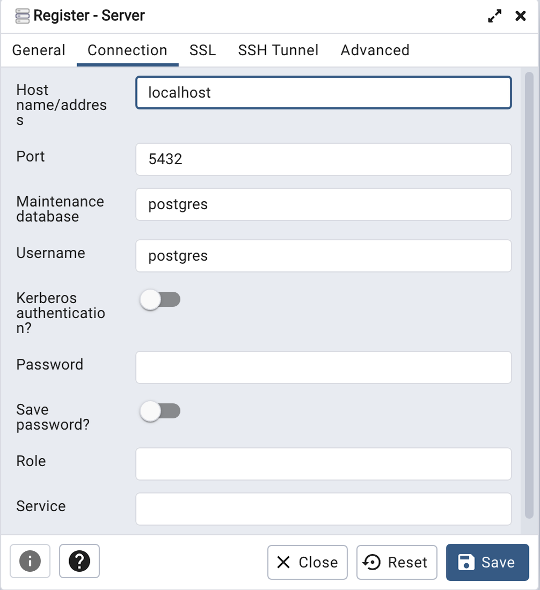
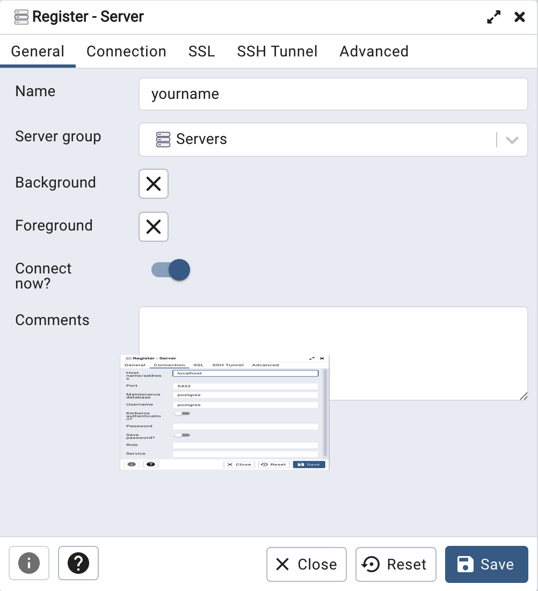
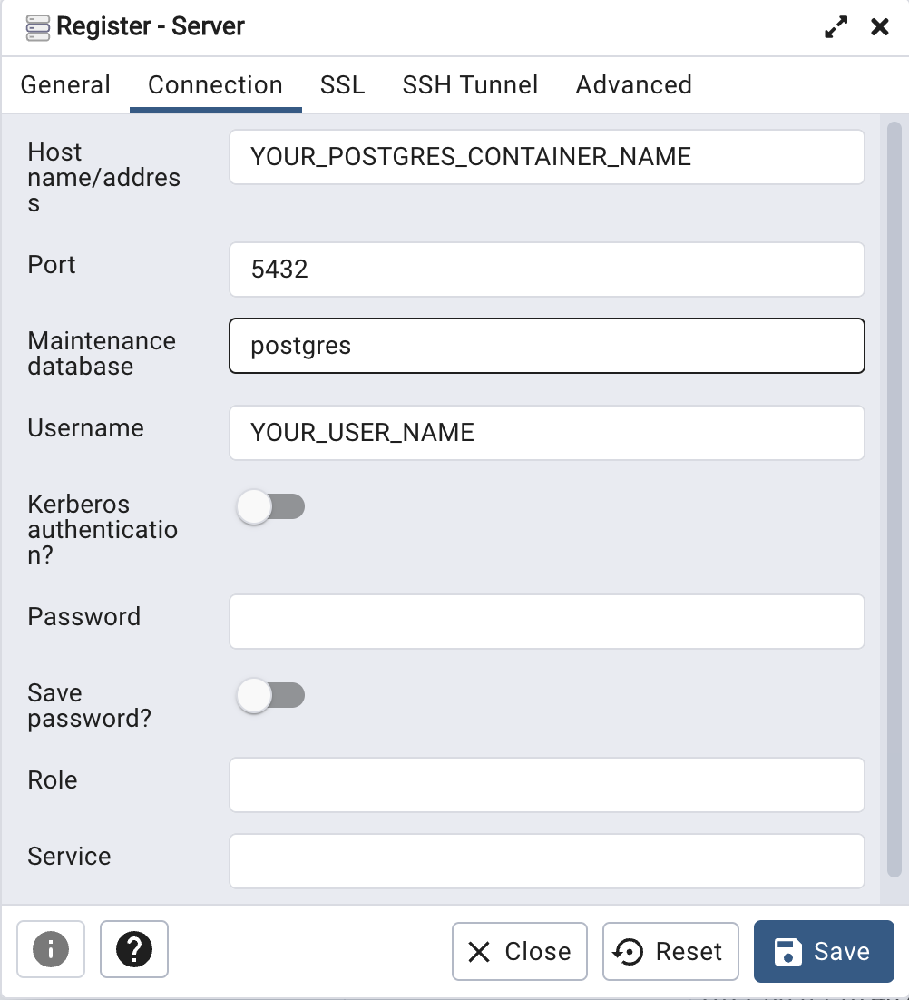
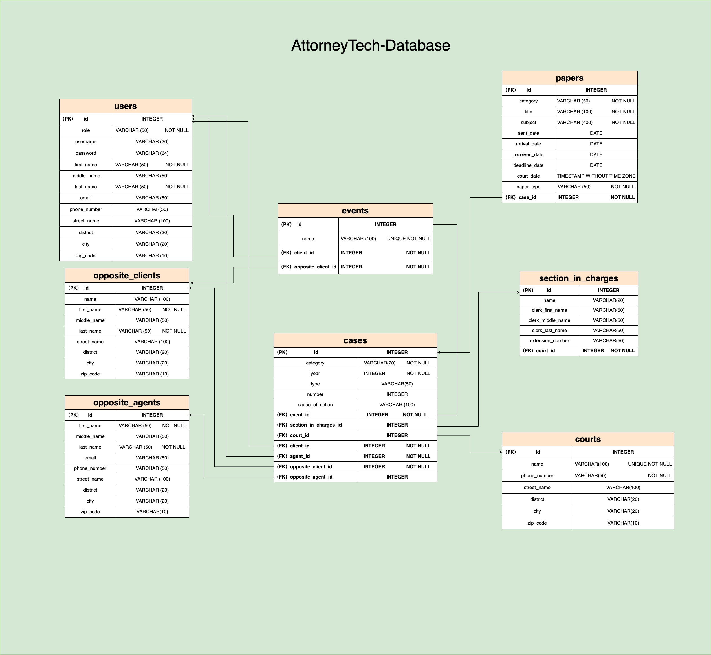

# Database-PostgreSQL

## Table of Contents

* [Run PostgreSQL on localhost](#run-postgresql-on-localhost)
* [PostgreSQL via pgAdmin](##Connect-PostgreSQL-via-pgAdmin)
* [Run in docker container](##Run-in-docker-container)
* [Run with docker compose](##Run-containers-with-docker-compose)
* [Database Schema](##Database-Schema)

## Run PostgreSQL on localhost

### Downloading PostgreSQL from homebrew

```shell
$ brew install postgresql
```

### Start PostgreSQL service

```shell
$ brew services start postgresql
```

### Creating a Database

```shell
$ createdb database_name
```

If this produces no response then this step was successful

You can then connect to the database with:

```shell
$ psql database_name
```

## Connect PostgreSQL via pgAdmin

Open pgAdmin and right click on Server



Enter a name, hostname, port 5432 (default), database name and username.





## Run in docker container

### Download docker form brew

```shell
$ brew install --cask docker
```

Because docker is a system-level package, you cannot install it using brew install, and must use `--cask` instead.

Then launch the docker app. Click next. It will ask for privileged access. Confirm.

A whale icon should appear in the top bar. Click it and wait for "Docker is running" to appear.

### Pull the image

```shell
$ docker pull postgres:14.3
```

```shell
$ docker pull dpage/pgadmin4
```

If not add tag, it will pull the latest version of image

### Create and run container

There are many option parameters you can choose by yourself

And here we're going to set：

```shell
$ docker run -e POSTGRES_USER=username \
             -e POSTGRES_PASSWORD=password \
             --net=network_name \
             -d \
             postgres:14.3
```

```shell
$ docker run -p 5050:80 \
             -e PGADMIN_DEFAULT_EMAIL=email \
             -e PGADMIN_DEFAULT_PASSWORD=password \
             --net=YOUR_network_name \
             -d \
             dpage/pgadmin4
```

We set `-p` bound the localhost port to containers port, and set `--net` deploy two containers to the same network, and we want two containers run in background, so set `-d` here.

### Open pgadmin in browser

URL: `http://localhost:5050`

Enter the information we just got.



## Run containers with docker compose

In order to run multiple Containers at a time, it is more convenient to use docker compose

### Create `docker-compose.yaml` file

>Here is a [sample code][docker-compose-example] depends on docker-compose version 3.7, note that may have differences among the different versions.

You can change the following parts in the example code:

1. `POSTGRES_USER` Naming the username by yourself if necessary, otherwise `postgres` will be the default name.

2. `POSTGRES_PASSWORD`
It must not be empty or undefined, you must specify to it.

3. `PGADMIN_DEFAULT_EMAIL` and `PGADMIN_DEFAULT_PASSWORD` are also have to be defined by yourself.

### Run containers

```shell
$ docker-compose up -d
```

Put the `docker-compose.yaml` file in the same folder as your project and run the command above.

At the same time, `docker-compose` will also create a network and put the container in it.

## Database Schema



[docker-compose-example]: <docker-compose-example.yaml>

### Tables and Columns

>This database is designed for law firms in Taiwan, so from this point of view, we need the following tables and columns. In addition, some words will be marked with Traditional Chinese (hereafter referred to as Chinese) explanation. _**In addition, all the tables use `PostgreSQL identity column` creates the id column as Primary Key in `GENERATED ALWAYS AS IDENTITY` way and the data type is `INTEGER`.**_

#### `users`

Contains _**clients**_ and _**attorneys**_.
Enter `client` or `attorney` in `role` column to identify that row which one is.

```database
| Column       | Data Type            | Description                    |
| :---         | :----                | :---                           |
| id           | INTEGER              | primary key                    |
| role         | VARCHAR(50) NOT NULL | identify clients or attorneys  |
| first_name   | VARCHAR(50) NOT NULL | first name                     |
| last_name    | VARCHAR(50) NOT NULL | last name                      |
| email        | VARCHAR(50)          | email                          |
| phone_number | VARCHAR(50)          | phone number                   |
| addresses_id | INTEGER              | foreign key to addresses table |
```

#### `opposites`

Contains _**opposite**_ and _**opposite_agent**_.
Enter `opposite` or `opposite_agent` in `role` column to identify that row which one is.

```database
| Column       | Data Type            | Description                         |
| :---         | :----                | :---                                |
| id           | INTEGER              | primary key                         |
| role         | VARCHAR(50) NOT NULL | identify opposite or opposite_agent |
| first_name   | VARCHAR(50) NOT NULL | first name                          |
| last_name    | VARCHAR(50) NOT NULL | last name                           |
| email        | VARCHAR(50)          | email                               |
| phone_number | VARCHAR(50)          | phone number                        |
| addresses_id | INTEGER              | foreign key to addresses table      |
```

#### `papers_type`

There are many types of legal case paper. In order to avoid entering the paper type every time you receive or deliver a paper, here build the paper type into a table.

```database
| Column       | Data Type                   | Description           |
| :---         | :----                       | :---                  |
| id           | INTEGER                     | primary key           |
| papers_type  | VARCHAR(50) UNIQUE NOT NULL | likes “起訴狀”,“答辯狀” |
```

#### `papers`

Contains _**paper_sent**_ and _**paper_received**_.
Enter `paper_sent` or `paper_received` in `papers_kind` column to identify that row which one is.

```database
| Column        | Data Type             | Description                                    |
| :---          | :----                 | :---                                           |
| id            | INTEGER               | primary key                                    |
| papers_kind   | VARCHAR(50) NOT NULL  | identify paper sent or received                |
| sent_date     | DATE                  | sent date of papers                            |
| subject       | VARCHAR(400) NOT NULL | subject of papers                              |
| arrival_date  | DATE                  | papers we send and it's arrival date           |
| received_date | DATE                  | papers from opposite that we received          |
| deadline_date | DATE                  | if papers we received has something need to do |
| paper_type_id | INTEGER NOT NULL      | foreign key to papers_type table               |
| case_id       | INTEGER NOT NULL      | foreign key to cases table                     |
```

#### `section_in_charges`

Section in charge, which means “股別” in Chinese. In Taiwan's legal system, each case will be distributed to specific section in charge, it's important because when attorney want to contact court, he must go through section in charge.

```database
| Column            | Data Type       | Description                 |
| :---              | :----           | :---                        |
| id                | INTEGER         | primary key                 |
| name              | VARCHAR(20)     | name of section in charge   |
| clerks_first_name | VARCHAR(50)     | contact person's first name |
| clerks_last_name  | VARCHAR(50)     | contact person's last name  |
| extension_number  | VARCHAR(50)     | extension number            |
| court_id          | INTEGER NOT NULL| foreign key to courts table |
```

#### `cause_of_action`

Cause of action, which means “案由” in Chinese likes “拆屋還地”, “分割共有物”, etc. Cause of action is also an important thing in Taiwan's legal system, it indicates what legal disputes are involved in this case.

```database
| Column       | Data Type                   | Description     |
| :---         | :----                       | :---            |
| id           | INTEGER                     | primary key     |
| cause        | VARCHAR(50) UNIQUE NOT NULL | likes “拆屋還地” |
```

#### `court`

As mentioned above, and so on in the `case` mentioned below, build court into a table in order to associate `section_in_charge` and `case`.

```database
| Column       | Data Type                    | Description                    |
| :---         | :----                        | :---                           |
| id           | INTEGER                      | primary key                    |
| name         | VARCHAR(100) UNIQUE NOT NULL | name of court                  |
| phone_number | VARCHAR(50) NOT NULL         | phone number of court          |
| addresses_id | INTEGER NOT NULL             | foreign key to addresses table |
```

#### `case`

Basically, in a law firm, it can be said that it operates by handling cases. Creating a table of case help us to associate with other tables.

```database
| Column                | Data Type            | Description                                     |
| :---                  | :----                | :---                                            |
| id                    | INTEGER              | primary key                                     |
| category              | VARCHAR(20) NOT NULL | means “案件類別” in Chinese likes “民事” or “刑事” |
| year                  | INTEGER NOT NULL     | The year of the case, Taiwan's legal system is
                                                 mainly calculated from the years of the
                                                 Republic of China. For example, 2022 year is
                                                 equal to 111 year in Taiwan.                    |
| type                  | VARCHAR(50)          | means “案號字別” in Chinese. For example, like 
                                                 “訴”, “上”, “重訴”, “勞訴” ,etc.                  |
| number                | INTEGER              | number of cases                                 |
| section_in_charges_id | INTEGER              | foreign key to section in charges table         |
| cause_of_actions_id   | INTEGER              | foreign key to cause of actions table           |
| courts_id             | INTEGER              | foreign key to courts table                     |
| clients_id            | INTEGER NOT NULL     | foreign key to users table                      |
| attorneys_id          | INTEGER NOT NULL     | foreign key to users table                      |
| opposites_id          | INTEGER              | foreign key to opposites table                  |
| opposites_agent_id    | INTEGER              | foreign key to opposites table                  |
```
