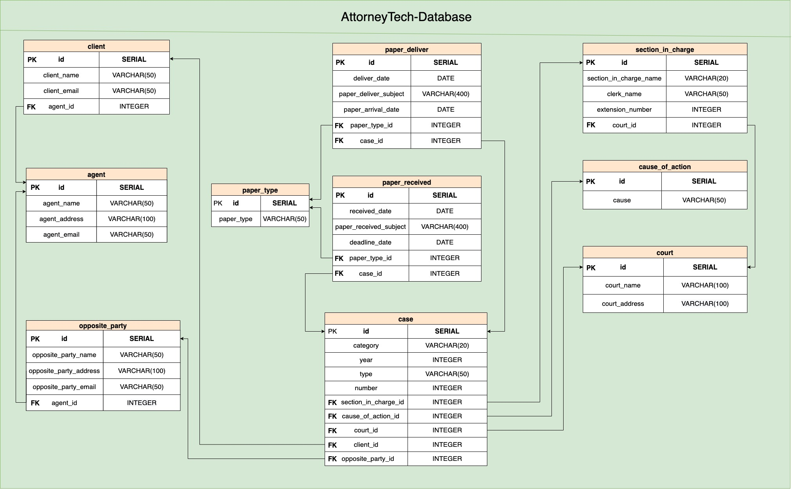

# Database-PostgreSQL

## Table of Contents

* [Run PostgreSQL on localhost](#run-postgresql-on-localhost)
* [PostgreSQL via pgAdmin](##Connect-PostgreSQL-via-pgAdmin)
* [Run in docker container](##Run-in-docker-container)
* [Run with docker compose](##Run-containers-with-docker-compose)
* [Database Schema](##-Database-Schema)

## Run PostgreSQL on localhost

### Downloading PostgreSQL from homebrew

```shell
$ brew install postgresql
```

### Start PostgreSQL service

```shell
$ brew services start postgresql
```

### Creating a Database

```shell
$ createdb database_name
```

If this produces no response then this step was successful

You can then connect to the database with:

```shell
$ psql database_name
```

## Connect PostgreSQL via pgAdmin

Open pgAdmin and right click on Server


Enter a name, hostname, port 5432 (default), database name and username.


## Run in docker container

### Download docker form brew

```shell
$ brew install --cask docker
```

Because docker is a system-level package, you cannot install it using brew install, and must use `--cask` instead.

Then launch the docker app. Click next. It will ask for privileged access. Confirm.

A whale icon should appear in the top bar. Click it and wait for "Docker is running" to appear.

### Pull the image

```shell
$ docker pull postgres:14.3
```

```shell
$ docker pull dpage/pgadmin4
```

If not add tag, it will pull the latest version of image

### Create and run container

There are many option parameters you can choose by yourself

And here we're going to set：

```shell
$ docker run -e POSTGRES_USER=username \
             -e POSTGRES_PASSWORD=password \
             --net=network_name \
             -d \
             postgres:14.3
```

```shell
$ docker run -p 5050:80 \
             -e PGADMIN_DEFAULT_EMAIL=email \
             -e PGADMIN_DEFAULT_PASSWORD=password \
             --net=YOUR_network_name \
             -d \
             dpage/pgadmin4
```

We set `-p` bound the localhost port to containers port, and set `--net` deploy two containers to the same network, and we want two containers run in background, so set `-d` here.

### Open pgadmin in browser

URL: `http://localhost:5050`

Enter the information we just got.


## Run containers with docker compose

In order to run multiple Containers at a time, it is more convenient to use docker compose

### Create `docker-compose.yaml` file

>Here is a [sample code][docker-compose-example] depends on docker-compose version 3.7, note that may have differences among the different versions.

You can change the following parts in the example code:

1. `POSTGRES_USER` Naming the username by yourself if necessary, otherwise `postgres` will be the default name.

2. `POSTGRES_PASSWORD`
It must not be empty or undefined, you must specify to it.

3. `PGADMIN_DEFAULT_EMAIL` and `PGADMIN_DEFAULT_PASSWORD` are also have to be defined by yourself.

### Run containers

```shell
$ docker-compose up -d
```

Put the `docker-compose.yaml` file in the same folder as your project and run the command above.

At the same time, `docker-compose` will also create a network and put the container in it.

## Database Schema



[docker-compose-example]: <docker-compose-example.yaml>

### Tables and Columns

>This database is designed for law firms in Taiwan, so from this point of view, we need the following tables and columns. In addition, some words will be marked with Traditional Chinese (hereafter referred to as Chinese) explanation. _**In addition, all the tables use PostgreSQL SERIAL pseudo-types creates the id column as Primary Key.**_

#### `client`

Client, which means **”當事人“** in Chinese, is one of the members in a legal case. It's need to store the following columns related to the clients.

* **id (PK)**
  * Primary Key.

* **client_name**
  * Store client's name in `VARCHAR` data type, the length with limit is 50.

* **client_email**
  * In order to send mail or received papers to clients, it's need to store client's email in `VARCHAR` data type, the length with limit is 50.
* **agent_id (FK)**
  * This is the foreign key of this table. In a firm, each client may be in charge of a different lawyer, so this should be associated with the `agent` table. Store this data to `INTEGER`.

#### `agent`

Agent, which means **”代理人“** in Chinese, is one of the members in a legal case. We need to store the following columns related to the agents. Incidentally, since in some legal cases do not necessarily require the attorney, sometimes an agent who is not a attorney, so here we use agent instead of attorney.

* **id (PK)**
  * Primary Key.

* **agent_name**
  * Store client's name in `VARCHAR` data type, the length with limit is 50.
* **agent_address**
  * Store client's address in `VARCHAR` data type, and since the address in Chinese is usually very long, so length with limit is 100.
* **agent_email**
  * Sometimes we need to contact opposite party' agent in email, so here store agent's email in `VARCHAR` data type, the length with limit is 50.

#### `opposite_party`

Opposite party, which means **“對造”** in Chinese, is one of the members in a legal case too. We need to store the following columns related to the opposite party. In addition, as mentioned above, since in some legal cases do not necessarily require the attorney. Therefore, the opposite party may not appoint any agent, so in that case, we need to store the address and email for contact.

* **id (PK)**
  * Primary Key.

* **opposite_party_name**
  * Store opposite party's name in `VARCHAR` data type, the length with limit is 50.
* **opposite_party_address**
  * Store opposite party's address in `VARCHAR` data type, the length with limit is 100.
* **opposite_party_email**
  * Store opposite party's email in `VARCHAR` data type, the length with limit is 50.
* **agent_id (FK)**
  * This is the foreign key column of this table, associated with the `agent` table if the opposite party appoint an agent. Store this data to `INTEGER`.

#### `paper_type`

There are many types of legal case paper. In order to avoid entering the paper type every time you receive or deliver a paper, here build the paper type into a table.

* **id (PK)**
  * Primary Key.

* **paper_type**
  * Store paper type in `VARCHAR` data type, the length with limit is 50.

#### `paper_deliver`

This column store papers deliver from law firm. It's need to store the following columns related to the delivered papers.

* **id (PK)**
  * Primary Key.

* **deliver_date**
  * Store the date the paper was delivered in `DATE` data type.

* **paper_deliver_subject**
  * Simply save the subject of the paper delivered for a quick and easy understanding of what the purpose of the paper is. Store the data in `VARCHAR` data type, the length with limit is 400.

* **paper_arrival_date**
  * It's important for law firm to record when the delivered paper was arrival. Store the date in `DATE` data type.

* **paper_type_id (FK)**
  * This is the foreign key column of this table, associated with the `paper_type` to record the type of paper delivered.Store this data to `INTEGER`.

* **case_id (FK)**
  * This is the foreign key column of this table, associated with the `case_id` to record which case the paper was delivered. Store this data to `INTEGER`.

#### `paper_received`

This column store papers received from others like courts or opposite party. It's need to store the following columns related to the delivered papers.

* **id (PK)**
  * Primary Key.

* **received_date**
  * Store the date the paper received in `DATE` data type.

* **paper_received_subject**
  * Simply save the subject of the paper received for a quick and easy understanding of what the purpose of the paper is. Store the data in `VARCHAR` data type, the length with limit is 400.

* **deadline_date**
  * Sometimes the paper received which will mention something attorney have to do before deadline. Therefore, It's very important to record the deadline. Store the date in `DATE` data type.

* **paper_type_id (FK)**
  * This is the foreign key column of this table, associated with the `paper_type` to record the type of paper received. Store this data to `INTEGER`.

* **case_id (FK)**
  * This is the foreign key column of this table, associated with the `case_id` to record which case the paper was received. Store this data to `INTEGER`.

#### `section_in_charge`

Section in charge, which means “股別” in Chinese. In Taiwan's legal system, each case will be distributed to specific section in charge, it's important because when attorney want to contact court, he must go through section in charge.

* **id (PK)**
  * Primary Key.

* **section_in_charge_name**
  * Store this data to `VARCHAR` data type, the length with limit is 20.

* **clerk_name**
  * Each section in charge will has a clerk in charge as contact person. Store this data to `VARCHAR` data type, the length with limit is 50.

* **extension_number**
  * Saving this data will help attorney quickly search for extensions in the future. Store this data to `INTEGER`.

* **court_id (FK)**
  * Different courts will have the same section in charge name, so here we need to associate the court table. Store this data to `INTEGER`.

#### `cause_of_action`

Cause of action, which means “案由” in Chinese like “拆屋還地”, “分割共有物”, etc. Cause of action is also an important thing in Taiwan's legal system, it indicates what legal disputes are involved in this case.

* **id (PK)**
  * Primary Key.

* **section_in_charge_name**
  * Store this data to `VARCHAR` data type, the length with limit is 50.

#### `court`

As mentioned above, and so on in the `case` mentioned below, build court into a table in order to associate `section_in_charge` and `case`.

* **id (PK)**
  * Primary Key.

* **court_name**
  * Store this data to `VARCHAR` data type and some court's name are very long, so the length with limit is 100.

* **court_address**
  * Store this data to `VARCHAR` data type and because addresses are generally long that the length with limit is 100.

#### `case`

Basically, in a law firm, it can be said that it operates by handling cases. Creating a table of case help us to associate with other tables.

* **id (PK)**
  * Primary Key.

* **category**
  * Category means “案件類別” in Chinese, category of case may be civil (民事) case, criminal (刑事) case, etc. Store in `VARCHAR` data type, the length with limit is 20.

* **year**
  * The year of the case, Taiwan's legal system is mainly calculated from the years of the Republic of China. For example, 2022 year is equal to 111 year in Taiwan. So here we store this data to `INTEGER`.

* **type**
  * The type of case, means “案號字別” in Chinese. For example, like “訴”, “上”, “重訴”, “勞訴”, etc. Each type mention to different essence even procedure of law suit. Here it will store this data to `VARCHAR` data type, the length with limit is 50.

* **number**
  * Each case will has it's number, it will be stored to `INTEGER`.

>As above, each case will associated with section in charge, cause of action, court, client and opposite party, so it's necessary to add foreign keys below:

* **section_in_charge_id (FK)**

* **cause_of_action_id (FK)**

* **court_id (FK)**

* **client_id (FK)**

* **opposite_party_id (FK)**
